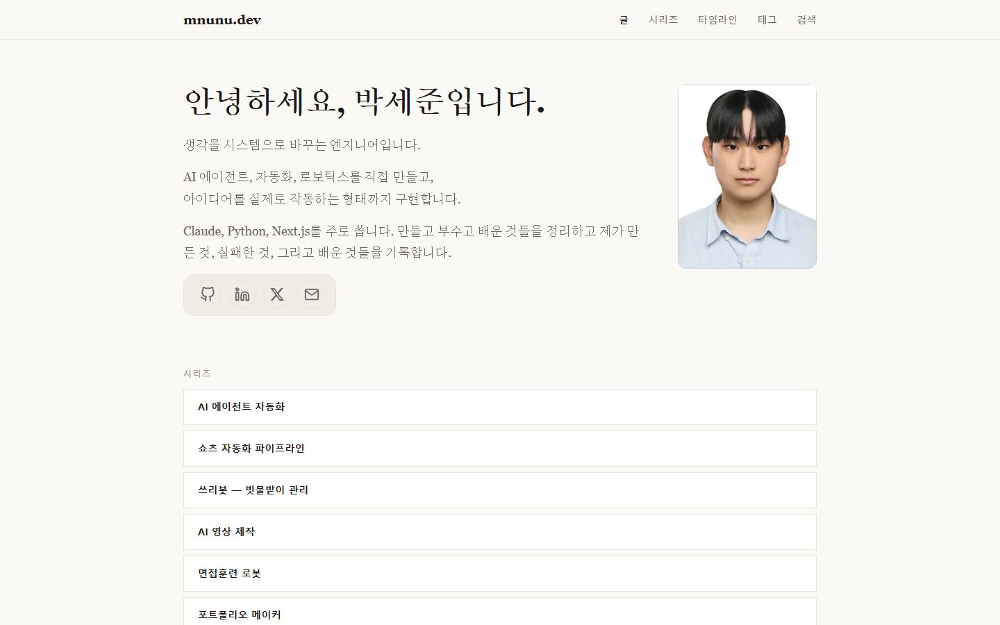
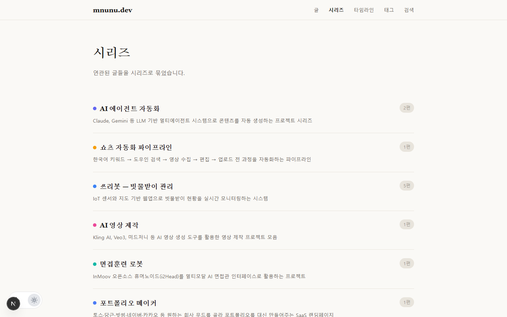
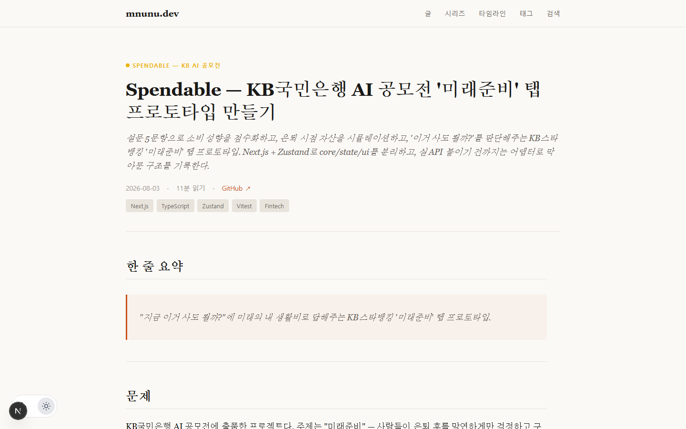

# mnunu.dev

AI 자동화, 웹 개발, 로보틱스 프로젝트 기록을 남기는 개인 기술 블로그 겸 포트폴리오 사이트입니다.
Next.js(App Router) + MDX 기반으로, 코드 하이라이팅(Shiki)과 다크모드를 지원합니다.

- **Stack**: Next.js · TypeScript · MDX(`next-mdx-remote`, `gray-matter`) · Tailwind · Framer Motion · Three.js
- **콘텐츠**: 시리즈/태그 기반으로 정리된 프로젝트 회고 포스트 (`content/posts/`)

## 실제 구동 화면

`npm run dev`로 직접 실행한 뒤 캡처한 실제 화면입니다.


*홈(`/`) — 자기소개와 시리즈 목록(AI 에이전트 자동화, 쇼츠 파이프라인, 쓰리봇, AI 영상 제작 등).*


*시리즈 목록(`/series`) — 시리즈별 색상 태그, 편 수, 한 줄 설명.*


*포스트 상세(`/posts/spendable/overview`) — frontmatter 기반 제목/요약/태그/읽기시간과 본문 콜아웃 렌더링.*

## 주요 기능

- **시리즈 네비게이션**: 관련 프로젝트를 하나의 시리즈로 묶어 순서대로 탐색 (`/series/[seriesId]`)
- **태그/검색**: 태그별 목록(`/tags/[tag]`), 검색 페이지(`/search`)
- **타임라인**: 포스트를 시간순으로 보여주는 `/timeline`
- **RSS**: `src/app/feed.xml`
- **OG 이미지 자동 생성**: `src/app/api/og/route.tsx`
- **다크모드**: FOUC 방지를 위해 하이드레이션 전에 테마를 적용 (`localStorage` 기반)

## 콘텐츠 구조

```
content/posts/<series>/<slug>.mdx   # 포스트 (frontmatter: title, series, tags, summary, githubUrl ...)
public/images/<series>/             # 포스트 본문 이미지
public/thumbnails/<series>/         # 포스트 썸네일 (OG/카드용)
_planning/                          # 콘텐츠 기획 문서 (프로젝트 인벤토리, 편집 가이드, 포스팅 우선순위 등)
```

현재 다루는 시리즈:

| 시리즈 | 내용 |
| --- | --- |
| `ai-agent` | 멀티 에이전트 자동화 (상세페이지 자동 생성기 등) |
| `ai-video` | AI 영상 제작 파이프라인 |
| `interview-robot` | InMoov 기반 인터뷰 로봇 |
| `portfolio-maker` | 포트폴리오 자동 생성기 |
| `shorts-pipeline` | 쇼츠 영상 자동 수집 파이프라인 (auto-rank) |
| `spendable` | KB국민은행 AI 공모전 '미래준비' 탭 프로토타입 |
| `threebot` | 쓰리봇(빗물받이 관리 플랫폼) — 펌웨어, 지도 UI, 인프라 |

## 실행

```bash
npm install
npm run dev      # http://localhost:3000
npm run build
npm run lint
```

## 새 포스트 작성

1. `content/posts/<series>/<slug>.mdx` 생성, frontmatter에 `title` / `slug` / `series` / `seriesOrder` / `tags` / `summary` / `thumbnail` 작성
2. 본문 이미지는 `public/images/<series>/`, 썸네일은 `public/thumbnails/<series>/`에 배치
3. 시리즈가 새로운 경우 `_planning/content-taxonomy.json`에 항목 추가
