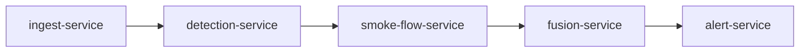

# Editorial Guidelines
> 포스트 작성 원칙 — 이 가이드라인은 모든 포스트에 적용

---

## 핵심 원칙

1. **파일 먼저, 추정 금지**: 포스트 초안은 반드시 실제 파일(README, 코드, 설정)을 읽은 뒤 작성. 접근 불가한 소스(Notion 비공개 등)는 포스트에 명시.
2. **시리즈 우선**: 카테고리보다 시리즈 연결을 강조. 모든 포스트 하단에 시리즈 네비게이션 필수.
3. **중복 묶기**: 동일 프로젝트의 실험/시도 기록은 별도 포스트가 아닌 시리즈의 한 편으로 묶음.
4. **완료된 것만 포스팅**: 미완 계획은 "다음 단계"에만 언급. 구현되지 않은 내용을 구현된 것처럼 쓰지 않음.

---

## 포스트 구조 규칙

### 제목 패턴
- 프로젝트 개요: `{프로젝트명} 만들기 — {핵심 키워드}`
  - 예: `산불 CCTV 협력 감지 시스템 만들기 — Python 마이크로서비스 5개의 협업`
- 트러블슈팅: `{문제} 해결한 방법 — {원인}`
  - 예: `도우인 봇 차단 우회한 방법 — Playwright + Chrome channel`
- 회고: `{기간/프로젝트} 회고 — {핵심 교훈}`

### 길이 기준
| 포스트 유형 | 권장 분량 |
|------------|----------|
| 프로젝트 개요 | 2,000 ~ 3,500자 |
| 트러블슈팅 | 800 ~ 1,500자 |
| 실험 | 1,000 ~ 2,000자 |
| 회고 | 1,500 ~ 2,500자 |

---

## 코드 블록 규칙

- 반드시 언어 명시: ` ```python `, ` ```typescript `, ` ```bash `
- 실제 프로젝트 코드 인용 시 파일 경로 주석 첫 줄에 표시
- 핵심 로직만 발췌. 전체 파일 붙여넣기 금지 (링크로 대체)
- 긴 코드는 핵심 부분 + `# ... 생략 ...` 처리

```python
# app/services/douyin_search_service.py (발췌)
async def search(self, keywords: list[str]) -> list[VideoCandidate]:
    # ... 생략 ...
    await page.goto(f"https://www.douyin.com/search/{keyword}")
```

---

## 이미지 규칙

- 캡션 필수: `*그림 1: 시스템 아키텍처 다이어그램*`
- 스크린샷은 한국어 UI도 그대로 사용 (별도 번역 불필요)
- 아키텍처 다이어그램은 텍스트 기반(Mermaid)으로 우선, 이미지는 보조



---

## 접근 불가 소스 처리

포스트 내에서 접근하지 못한 소스를 참조할 경우:

```markdown
> **참고**: 이 포스트의 Notion 기획 문서는 비공개로 설정되어 있어 내용을 직접 인용하지 않습니다.
```

---

## 썸네일 작성 가이드

| 우선순위 | 썸네일 소스 |
|---------|-----------|
| 1순위 | 프로젝트 결과물 스크린샷 (실제 UI, 터미널 출력) |
| 2순위 | 아키텍처 다이어그램 캡처 |
| 3순위 | 시리즈 색상 + 제목 텍스트 자동 생성 (코드) |

파일명 규칙: `/public/thumbnails/{series-slug}/{post-slug}.png`

---

## 포스트 추가 워크플로우

새 프로젝트를 블로그에 추가할 때:

1. `project-inventory.md`에 프로젝트 항목 추가
2. `content-taxonomy.json`에 시리즈 또는 포스트 슬러그 추가
3. `content/posts/{series-slug}/{post-slug}.mdx` 파일 생성
4. 썸네일 이미지를 `public/thumbnails/{series-slug}/` 에 추가
5. `npm run dev`로 로컬 확인 후 배포
