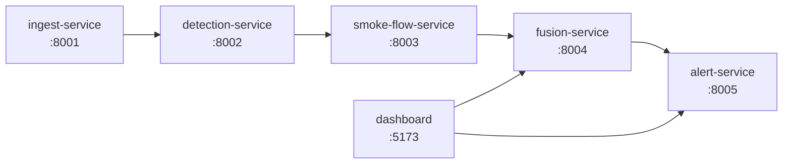

## 한 줄 요약

> 단일 CCTV로는 발화 지점을 특정할 수 없다. 여러 대가 협력하면 삼각측량이 가능하다.

---

## 문제

산불 초기 감지에서 가장 어려운 부분은 **"어디서 불이 났는가"**를 빠르게 파악하는 것이다.
단일 CCTV 카메라는 연기를 감지할 수는 있지만, 카메라 시야각과 거리 정보만으로는 실제 발화 지점을 좌표로 특정하기 어렵다.

해결책은 간단하다: **여러 카메라가 동시에 같은 연기를 보면**, 각 카메라의 방향 벡터를 교차시켜 발화 지점을 추정할 수 있다. 문제는 이걸 실시간으로, 느슨하게 결합된 구조로 구현하는 것이었다.


---

## 접근

## 하드웨어 스택

실제 운용 환경에서는 소프트웨어 이전에 하드웨어 구성이 먼저다.

| 구성 요소 | 사양 | 역할 |
|-----------|------|------|
| **열화상 카메라** | FLIR Lepton / FLIR ONE | 야간·연무 환경에서 열 신호 감지 |
| **가시광 카메라** | 일반 RTSP IP 카메라 | 연기 영상 확인, optical flow 계산 |
| **LiDAR** | 단거리 LiDAR 모듈 | 거리 데이터 보조 — 발화 지점 추정 정확도 향상 |
| **감지 모델** | YOLOv8 (custom fine-tuned) | 연기·화재 객체 감지 |
| **통신** | MQTT (Mosquitto) | 서비스 간 실시간 이벤트 브로드캐스트 |
| **미디어 서버** | MediaMTX | RTSP 스트림 수신·분배 |

FLIR 열화상 카메라는 가시광 카메라가 놓치는 **야간 및 짙은 연무 환경**에서 열 신호를 직접 감지할 수 있어 초기 감지 신뢰도를 높인다. LiDAR는 카메라만으로는 부정확한 거리 추정을 보완한다.


---

### 왜 마이크로서비스인가?

각 기능(영상 수집, 감지, 벡터 계산, 융합, 알림)을 하나의 모놀리식 앱에 넣으면 단기적으로는 쉽지만, 카메라 수가 늘어나면 수평 확장이 어렵다. 또한 각 단계의 성능 병목이 다르기 때문에 독립적으로 스케일링할 수 있어야 했다.

### 시스템 구성

```
ingest-service     → RTSP 스트림을 받아 프레임 단위로 detection에 전달
detection-service  → 프레임에서 연기/화재 감지, 광류(optical flow) 벡터 계산
smoke-flow-service → 카메라별 연기 흐름 벡터를 집계
fusion-service     → 여러 카메라의 벡터를 지면에 투영, 발화 지점 추정
alert-service      → 추정 좌표를 받아 알림 발송, 이벤트 저장
```

모든 서비스 간 통신은 HTTP(REST). 비동기 이벤트는 파일 시스템 기반 이벤트 큐(`/data/events/`)로 처리했다.

---

## 구현

### 서비스 의존 관계



Docker Compose로 전체 스택을 한 번에 실행한다:

```bash
docker-compose up --build
# Dashboard → http://localhost:5173
```

인프라 레이어에는 MQTT 브로커(Mosquitto)와 미디어 서버(MediaMTX)가 포함된다. 실제 GPU나 영상 파일 없이도 `fake_event_generator.py`로 합성 이벤트를 주입해 전체 파이프라인을 테스트할 수 있다.

### 핵심: Fusion Engine의 발화 지점 추정

가장 기술적으로 흥미로운 부분은 `fusion-service`의 `fusion_engine.py`다.

각 카메라에서 오는 입력:
- 카메라 위치 (lat, lon, altitude)
- 카메라 자세 (yaw, pitch)
- 광류 벡터 (vx, vy) — 연기가 어느 방향으로 흐르는지

이 벡터를 **역방향**으로 추적해 연기의 출발점(발화 지점)을 추정한다:

```python
# services/fusion-service/fusion_engine.py (발췌)
def project_smoke_origin(
    camera_lat, camera_lon, camera_alt_m,
    yaw_deg, pitch_deg,
    flow_vx, flow_vy, magnitude, stability
) -> Tuple[Optional[Tuple[float, float]], float]:
    """
    MVP 지면 투영 (Flat-Earth 근사, 5km 이내 허용 오차)

    접근:
    - 광류 벡터를 역방향으로 추적 → 연기 발원 방향 추정
    - 카메라 시선 벡터를 지면에 투영 → 거리 추정
    - 신뢰도(confidence) 가중치로 다중 카메라 융합
    """
    # baseline 수평 거리: altitude / tan(pitch)
    eff_pitch = pitch_deg if pitch_deg != 0 else -5.0
    tan_pitch = math.tan(math.radians(abs(eff_pitch)))
    ...
```

여러 카메라의 추정값은 신뢰도 가중 평균으로 합산된다. MVP 단계에서는 Flat-Earth 근사를 사용했고, 실제 서비스에서는 카메라 캘리브레이션과 DEM(수치표고모델) 연동이 필요하다는 점을 코드 주석에 명시했다.

### Docker Compose 구성

```yaml
# docker-compose.yml (발췌)
services:
  mosquitto:
    image: eclipse-mosquitto:2.0
    ports: ["1883:1883"]

  ingest-service:
    build: ./services/ingest-service
    ports: ["8001:8001"]
    environment:
      - DETECTION_SERVICE_URL=http://detection-service:8002
    depends_on: [detection-service]

  detection-service:
    build: ./services/detection-service
    ports: ["8002:8002"]
    environment:
      - DETECTOR_BACKEND=${DETECTOR_BACKEND:-mock}  # GPU 없이 mock 사용 가능
```

`DETECTOR_BACKEND=mock` 환경변수로 실제 CV 모델 없이도 시스템 전체를 구동할 수 있게 했다.

---

## 시행착오

### 서비스 시작 순서 문제
Docker의 `depends_on`은 컨테이너가 **시작됨**을 보장할 뿐 **준비됨**을 보장하지 않는다. 초기에 ingest-service가 detection-service보다 먼저 요청을 보내 500 에러가 반복됐다.

해결책은 각 서비스에 헬스체크 엔드포인트(`GET /health`)를 추가하고, 상위 서비스가 하위 서비스의 헬스체크를 폴링한 뒤 요청을 보내도록 수정했다.

### Flat-Earth vs. 구면 좌표
5km 이내 거리에서는 Flat-Earth 근사(dx_m, dy_m → Δlat, Δlon)가 충분히 정확하지만, 그 이상에서는 오차가 누적된다. MVP 범위를 명확히 정의하고 README에 한계를 기록했다.

---

## 결과

- Docker Compose 단일 명령으로 5개 서비스 + 인프라 기동
- GPU/영상 파일 없이 `fake_event_generator.py`로 전체 파이프라인 검증
- 대시보드(React, port 5173)에서 감지 이벤트와 추정 좌표 실시간 확인
- fusion-service 단위 테스트: 단일 카메라, 다중 카메라 융합 시나리오 통과

---

## 감지 모델 — YOLOv8 연기 탐지


detection-service의 핵심은 YOLOv8 기반 연기/화재 탐지다. MVP 단계에서는 `DETECTOR_BACKEND=mock`으로 실제 모델 없이 파이프라인 전체를 검증했고, 이후 실제 데이터셋으로 fine-tuning한 모델을 연동했다.

```python
# detection-service/detector.py (발췌)
class YOLODetector:
    def __init__(self, model_path: str):
        self.model = YOLO(model_path)

    def detect(self, frame: np.ndarray) -> list[Detection]:
        results = self.model(frame, conf=0.4)
        return [
            Detection(
                label=r.names[int(cls)],
                confidence=float(conf),
                bbox=box.tolist()
            )
            for box, conf, cls in zip(
                results[0].boxes.xyxy,
                results[0].boxes.conf,
                results[0].boxes.cls
            )
        ]
```

FLIR 열화상 카메라 입력은 별도 채널로 처리 — 가시광 감지와 열화상 감지를 병렬로 실행한 뒤 fusion-service에서 합산한다.

---

## 다음 단계

- [ ] FLIR 열화상 카메라 실시간 스트림 연동
- [ ] YOLOv8 smoke-detector 모델 fine-tuning (실제 산불 데이터셋)
- [ ] LiDAR 거리 데이터와 카메라 벡터 융합으로 발화 지점 정확도 개선
- [ ] 카메라 캘리브레이션 파이프라인 구축
- [ ] DEM(수치표고모델) 연동으로 지면 투영 정확도 개선
- [ ] Fusion 알고리즘 고도화 (Kalman Filter 기반 추적)

---

_시리즈: [산불 CCTV 협력 감지](/series/wildfire-cctv) · 다음: 마이크로서비스 심층 분석 →_
